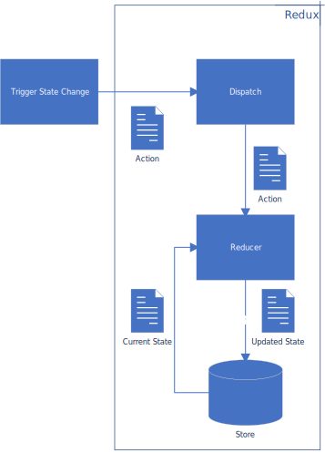

# Redux

Redux is a popular library for state management in javascript.  While it commonly is used in conjunction with React.js, there is nothing explicitly tying it to React.

[Link to Redux homepage](https://redux.js.org/)

At first dealing with Redux can be a somewhat daunting task.  However, it is really quite a simple system.

## Why Redux?
* Well defined pattern for state storage.
* Single state can be stored and retrieved later, for example in local storage, or passed on to the server.
* Debugging tools can be used to easily check internal application state without having to complex debuging sessions.
* Immutable state changes.

## Why not Redux?
* It requires a lot of extra code just to implement simple asynchronous operations.

# Architecture

There are several pieces and terms that are important to understand in Redux.

* Dispatch - This is a function used to issue "actions".
* Action - This is an object which represents a state change in the store.  Thus it is coined an action not because it does something, but because it describes what should change.
* Reducer - This takes actions and applies the state change to the store.
* Store - This is where the state is kept track of.

## Basic Flow

The following diagram can explain the basics of how a state change occurs in react.
1. _Something_ occurs in the application which will requires a state change (_Trigger State Change_).  The data that encompasses the state change is encapsolated as an _Action_.
2. The redux _Dispatch_ method from the _Store_ is invoked with the _Action_ to notify that a state change is to occur.
3. The _Dispatch_ method from redux takes the action and passes it to all _Reducer_ methods connected to the store. 
4. A _Reducer_ inspects the _Action_ object and _Current State_ from the _Store_ and applies the change based upon the "Action".
5. The resulting _Updated State_ is then written to the _Store_.

## Combining reducers in the Store

TODO: fill this in...

## Interaction with React.js

react-redux is a common library that provides a method named connect which can be used to connect a component with the redux store.  

Once you have implemented 

# Implementation

For a basic operation you need to implement:
1. Some method which calls dispatch to indicate that a state change should occur.
2. Some method which acts as the "Reducer" which changes that action into the actual state that will be in the "Store".  Using redux-thunk can simplify this process.
3. Create the store with an initial state and the reducers. Reduxers can be combined via the combineReducers method.

# Redux-Thunk

TODO: fill this in